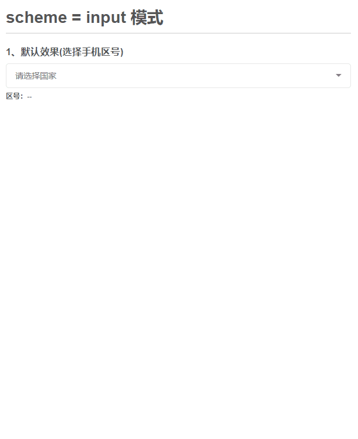
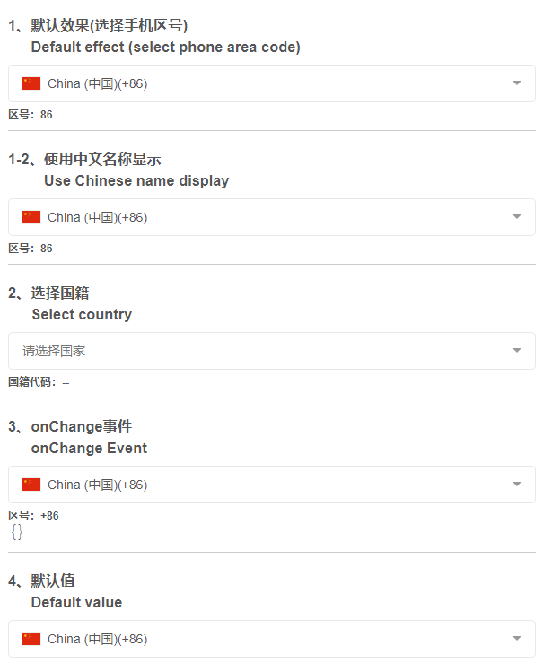
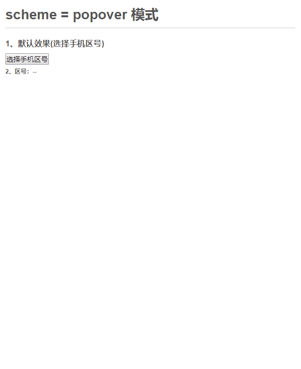
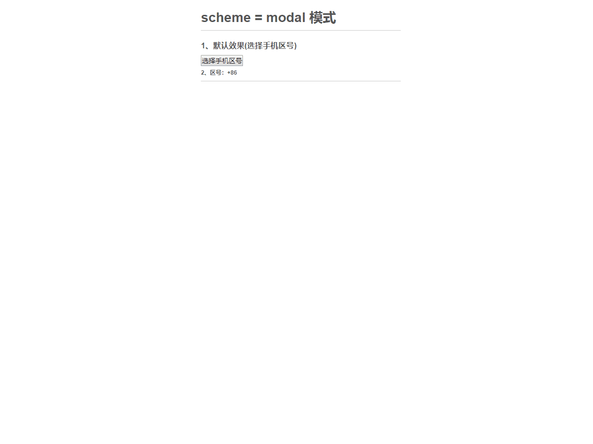
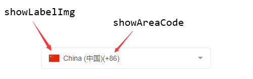
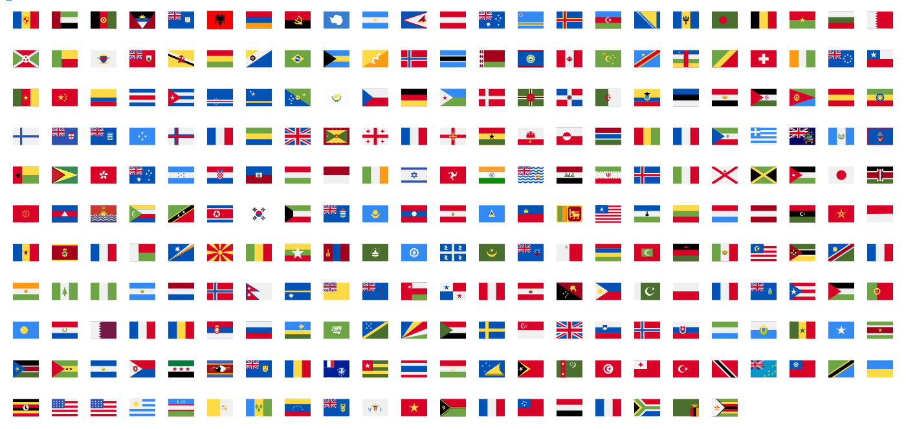

# 1 vue-country-intl
Vue-based mobile phone area code selection, nationality selection component, compatible with pc, mobile.`vue-country-intl`There are 3 modes（
input、popover、modal）

The country data supported by the plugin comes from:
+ iso2 code: https://en.wikipedia.org/wiki/ISO_3166-1_alpha-2
+ country code: https://en.wikipedia.org/wiki/List_of_country_calling_codes

## Effect preview
[https://941477276.github.io/vue-country-intl/dist/](https://941477276.github.io/vue-country-intl/dist/)

[中文文档](https://github.com/941477276/vue-country-intl/blob/master/README-CN.md)

## 1.1 Brother
>vue版的国籍/手机区号选择插件(`vue-country-intl`)
+ [vue-country-intl](https://github.com/941477276/vue-country-intl)
>react版的国籍/手机区号选择插件(`reaxt-country-intl`)
+ [react-country-intl](https://github.com/941477276/react-country-intl)
>微信小程序版的国籍/手机区号选择插件(`wx-country-intl`)
+ [wx-country-intl](https://github.com/941477276/wx-country-intl)
>基于better-scroll的下拉刷新、上拉加载Vue插件(`vue-scroll-refresh-load`)
+ [vue-scroll-refresh-load](https://github.com/941477276/vue-scroll-refresh-load)


## 1.2 Install
`npm install vue-country-intl --save`

## 1.3 Usage——.vue Single file
```
/*****main.js****/
import VueCountryIntl from 'vue-country-intl';
// import css
import 'vue-country-intl/lib/vue-country-intl.css'
// Global registration component
Vue.component(VueCountryIntl.name, VueCountryIntl);

/*****Used in components****/
<template>
    <vue-country-intl v-model="countryCode"></vue-country-intl>
</template>
```

## 1.4 Usage——Import js files directly
```
<link rel="stylesheet" href="./lib/vue-country-intl.css">
<script src="./lib/vue-country-intl.min.js"></script>
<script>
  Vue.component('vue-country-intl', vueCountryIntl);
  new Vue({
    el: '#app',
    data: {}
  });  
```

## 1.5 schema=input(default)
```
<template>
    <VueCountryIntl v-model="phoneCountry"></VueCountryIntl>
</template>    
```
effect:




display the nationality name in Chinese


## 1.6 schema=popover(popover)
```
<template>
    <button type="button" id="my_reference">Select phone area code</button>
    <VueCountryIntl schema="popover" elId="my_reference" v-model="phoneCountry">
    </VueCountryIntl>
</template>    
```
```
<template>
    <VueCountryIntl schema="popover" v-model="phoneCountry">
        <button type="button" slot="reference">Select phone area code</button>
    </VueCountryIntl>
</template>    
```
effect:



## 1.7 schema=modal
```
<template>
    <VueCountryIntl schema="modal" v-model="phoneCountry"></VueCountryIntl>
</template>    
```
effect:



## 1.8 props
1.`schema`: Display mode

+ input: Display as an `input` input box (default)
+ popover: Popover pop-up form
+ modal: Modal box pop-up form

2.`type`: Value type

+ phone: To select the area code
+ country: Select nationality

3.`placeholder`: The placeholder of the input box when `schema=input`

4.`searchAble`: Whether it can be searched (data type: Boolean)

5.`disabled`: Whether to disable (data type: Boolean)

6.`showAreaCode`: Whether to display the area code in the input box (data type: Boolean)



7.`showLabelImg`: Whether to display an image in the input box (data type: Boolean)

8.`onlyValue`: Whether to display only the selected value without displaying the nationality name (data type: Boolean)

9.`listZIndex`: z-index for list (data type：Number)

10.`maxHeight`: The maximum height of the list, pc default 350px, mobile default 240px (data type：Number)

11.`selectedText`: The copy to the right of the selected item in the list, the default is Selected (data type：String)

12.`showSelectedText`: Whether the right side of the 'Selected' file is displayed when the list item is selected, the default is true (data type: Boolean)

13.`readonly`: Read-only, default `false` (data type: Boolean)

14.`offsetTop`: The distance from the popover popup window to the reference element. The default is 10.Only valid when `schema=popover` (data type：Number)

15.`popoverClass`: Popover pop-up window extra class.Only valid when `schema=popover` (data type：String)

16.`referenceTrigger`: Click on whether the reference can display the popover popup. The default is true.Only valid when `schema=popover` (data type: Boolean)

17.`searchInputPlaceholder`: Search for the placeholder text in the input box,Only valid in schema=popover, schema=modal (data type：String)

18.`elId`: Trigger the id of the element displayed by the popover popup,Only valid in schema=popover mode (data type：String)

19.`modalClass`: Model pop-up extra class. Valid only when `schema=modal` (data type: String)

20: `visible`: Control component display and hide, you need to use the `sync` syntax, such as:`:visible.sync="show"`, valid only in schema=modal mode (data type: Boolean)

21: `cancelText`: Close the text of the button of the popup, default: 'Cancel', valid only in schema=modal mode (data type：String)

22: `disableCountry`: Disabled countries (can pass country name, country code, mobile area code), can pass strings or pass arrays, pass strings to disable multiple countries, need to be separated by commas（data type：String|Array）

23: `onlyCountry`: Display only the specified country, can pass a string or pass an array, multiple countries separated by commas when passing a string（data type：String|Array）

24: 'noDataText' : the copywriter displayed when the national data is not searched, if there is' vueCountryNoData 'slot, slot contents will be displayed first (data type: String)

25: `iosMobileReadonly`: Whether the input box is read-only in the ios mobile terminal (only valid in `schema = input` mode), the default is `true`. If it is not in the read-only mode in the ios mobile terminal, the selection box will pop up（data type: Boolean）

26: `useChiness`: Whether to display the nationality name in Chinese, the default is `false`.（data type: Boolean）

27: `filter`: Sorting function, consistent with the callback function in `Array.filter`. Default is `null` (data type: Function) `new in 1.1.5`

28: `sort`: Sorting function, consistent with the callback function in `Array.sort`. Default is `null` (data type: Function) `new in 1.1.5`

29: `transform`: Data processing function, you can use this function to deeply customize the data list, such as sorting, filtering, pinning, etc. The return value is a list of processed pairs. Default is `null` (data type: Function) `new in 1.1.6`

## 1.9 Methods(method)
1.`show`: Display list

2.`hide`: Hidden list

3.`getSelected`: Get the selected list item

4.`terminal`: Determine if ios or android terminal. Return data format：`{android: true, ios: false}`

## 1.10 slot
1.`vueCountryNoData`：Slot displayed when country data is not found

## 1.11 Event
1. `onChange`: Triggered when the user manually selects a list item, it will pass selected, value to onChange.
2. `show`: Triggered after the drop-down pop-up window is displayed (new in 1.1.4)`
3. `hide`: Triggered after the drop-down pop-up window is hidden (new in 1.1.4)`


# 2、country-flag
A Vue-based national flag flag component

## Effect preview


## 2.1、Install
`npm install vue-country-intl --save`

## 1.3、Usage
```
/*****main.js****/
import VueCountryFlag from 'vue-country-intl/lib/vue-country-flag.min.js';
// import css
import 'vue-country-intl/lib/vue-country-flag.css'

// Introduce svg icons
let flagFilePath = require.context('vue-country-intl/lib/country-flag-svgs', true, /\.svg$/);
Vue.use(VueCountryFlag, flagFilePath);

/*****components used****/
<template>
    <VueCountryFlag value="cn"></VueCountryFlag>
    <VueCountryFlag value="+86">
      <template v-slot="{country}">
        <span class="slot-span">国家：<mark>{{country.name}}</mark></span>
      </template>
    </VueCountryFlag>
</template>
```

## 1.4、props
1.`value`: Nationality code or phone area code value

2.`type`: value type

+ phone: Indicates the selection of the mobile phone area code
+ country: Indicates the choice of nationality

3.`iso2`: Nationality code, the iso2 attribute must be passed when type=phone, otherwise there will be problems when the area code is 212 or 358!

4.`useTitle`: Whether to add the `title` attribute to the element, the value of title is the code of the nationality or the area code of the mobile phone (data type: Boolean)

## 1.5、Methods
1.`getCountry`: Get detailed nationality information

## 1.6、Event
1.`click`: click event
